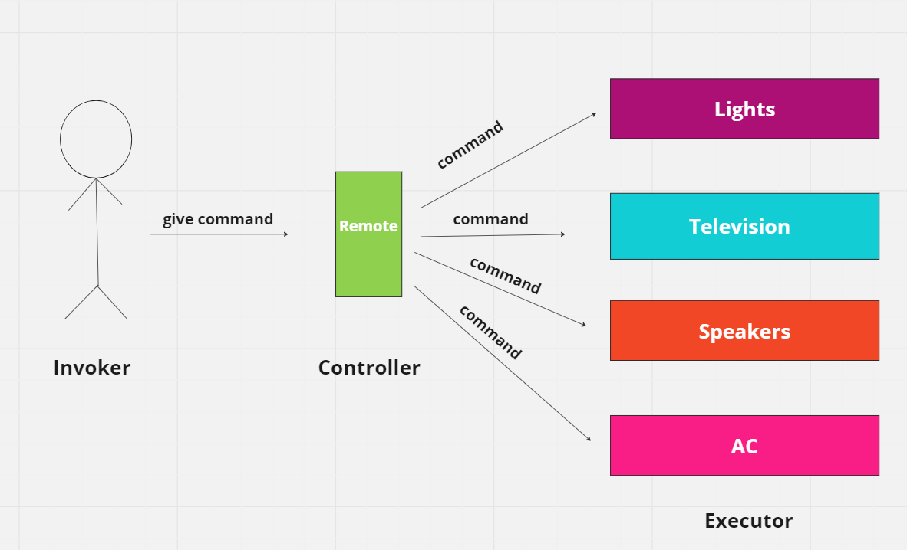

***
* In command pattern, the request is send to the invoker and invoker pass it to the encapsulated command object. Command object passes the request to the appropriate method of Receiver to perform the specific action. The client program create the receiver object and then attach it to the Command. Then it creates the invoker object and attach the command object to perform an action. Now when client program executes the action, it’s processed based on the command and receiver object.
***
* The Command Pattern encapsulates a request as an object, allowing for the separation of sender and receiver.
* Commands can be parameterized, meaning you can create different commands with different parameters without changing the invoker.
* It decouples the sender from the receiver, providing flexibility and extensibility.
* The pattern supports undoable operations by storing the state or reverse commands.
***
