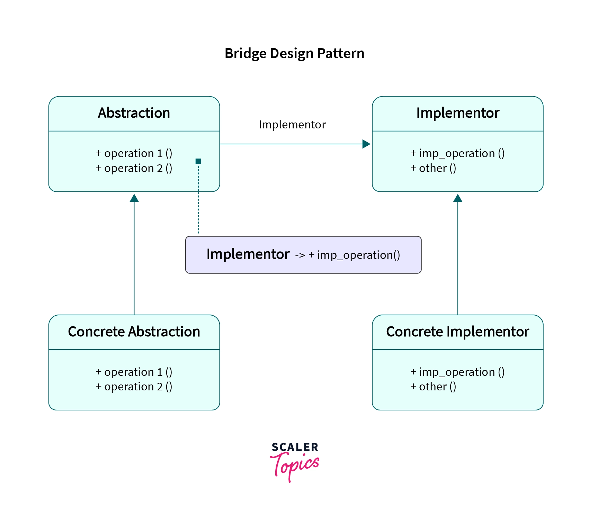

- The Bridge design pattern allows you to separate the abstraction from the implementation.
- Promotes independent extensibility of abstraction and implementation.
- Reduces complexity by avoiding deep inheritance hierarchies.
- Suitable when abstraction and implementation may evolve independently.
